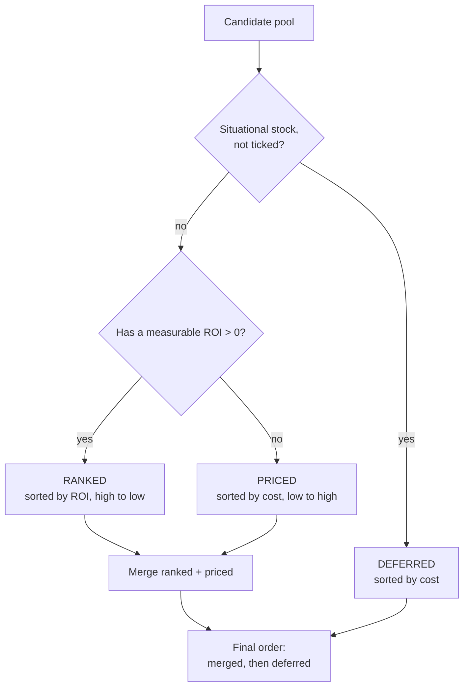
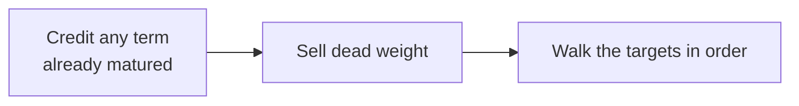
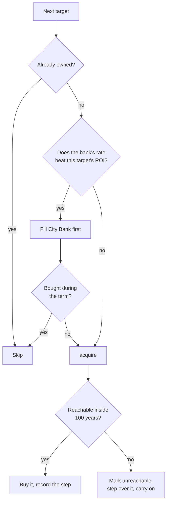
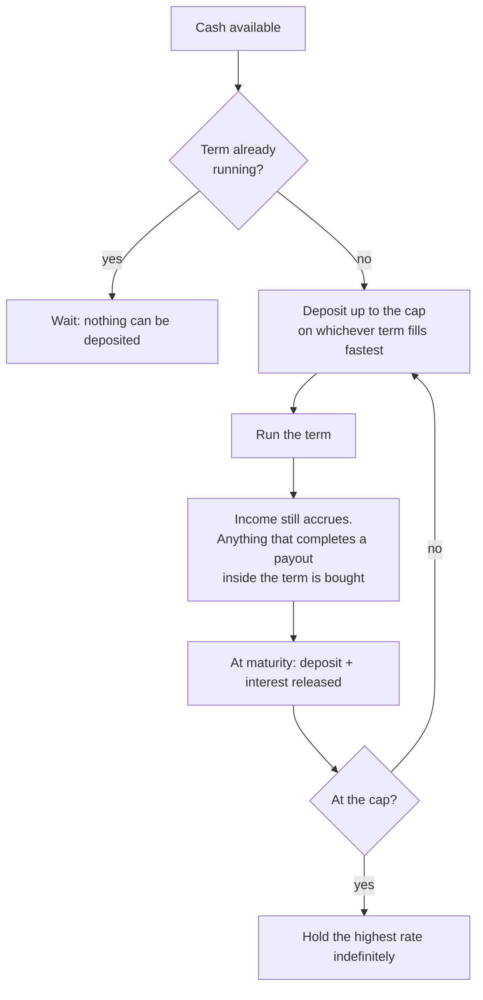

# How the planner thinks

_Reference for AutumnTornPlanner.html · v0.5.1_

**Disclaimer: This Logic Explanation document was generated by Claude, the logic loops, formulas, etc. were my own design, but I have no idea what Claude has written below and just like the readme document, can't really be bothered to actually read it. It took long enough solving all these problems, ain't nobody got time to read about it afterwards**

This document explains every judgement the planner makes: how an investment is
valued, how the order is chosen, and how the simulation decides what to buy on
which day. Plain English first, formulas where they pin something down.

---

## 0. The one-sentence version

> Value everything as an annual return on its price, rank it, then walk a
> day-by-day simulation that buys each thing in turn as soon as it can afford
> it, buying cheaper investments along the way to earn money while it saves,
> and selling them when the real target comes into reach.

Everything below is detail on those two halves: **ranking** and **simulating**.

---

## 1. What an investment is worth

Every row in the app (a stock benefit block, a Private Island, a bank term)
is reduced to three numbers.

| Symbol | Meaning |
|---|---|
| `cost` | What it takes to hold it: share price × shares required, or the property's total price |
| `annual` | What it returns in a year, in dollars |
| `roi` | `annual / cost` |

**ROI is the only ranking currency.** A benefit that isn't cash is converted to
cash first: an item benefit at its market value, energy or nerve at the price
of the cheapest refill item, points at the median market listing, a course
discount at the money saved. If a benefit can't be priced at all, the row has
no ROI and is handled separately (see §3).

```
annual = benefit_value × 365 / benefit_period_days
roi    = annual / cost
```

**Increments.** Torn's benefit blocks double in price for the same payout, so
block *n* costs 2ⁿ⁻¹ times block 1 and returns exactly the same amount:

```
cost(n) = shares_for_block_1 × price × 2^(n-1)
roi(n)  = annual / cost(n)  =  roi(1) / 2^(n-1)
```

So B2 is always half the ROI of B1, B3 a quarter, and so on. This is why deep
increments fall down the order on their own. No rule pushes them down; the
maths does.

### Two valuations that are computed, not read

**TCI** pays a share of the interest on your City Bank deposit. Valuing it
against today's balance had the planner buying it last or not at all, because
the plan is *going to* fill that bank. So inside the planner it is valued
against the cap the plan is heading for:

```
annual(TCI) = bank_cap × base_rate × 0.10
```

TCI *Active* is priced on the capital actually tied up for the week it is held,
not the full block price.

**Private Islands** are priced as purchase (−10% with Property Law) plus
upgrades (−10% if you own an ELT block). The two discounts apply to different
halves and never overlap.

---

## 2. The candidate pool

Before anything is ranked, the pool is assembled by `planCandidates()`.

- First blocks of every stock. Increments are generated here rather than reused
  from the Investments table, so the planner's own **Increments** setting
  governs them.
- Private Islands only if their checkbox is ticked; they are never sold once
  bought, so they can only ever be acquisitions, never parking.
- TCI appears once, as whichever of Passive or Active is selected.

**Increment generation.** The **Increments** dropdown is a *maximum, not a
minimum*: "B3" means "no deeper than B3", not "buy three of everything". On
**Optimum** the ladder is generated up to B12 and then pruned: anything the
money could never reach inside the horizon is not generated at all, where
"reach" is

```
reach = (capital + max(0, daily_budget) × 36,500) × 3
```

tripled to leave room for interest and for the returns of everything bought
along the way. A count you asked for explicitly is never pruned.

---

## 3. The order

`planOrder()` splits the pool into three piles.



**Ranked.** Anything with a real return, best first. This is the backbone.

**Priced.** Prioritised stocks whose benefit can't be given a dollar value
(TCM, TCP, LOS, SYS, WLT and friends). They can't be ranked, so they are judged
on price instead.

**Deferred.** Situational stocks you have *unticked* in the planner's
Situational Stocks list. Their benefit is only worth its value if you use it,
so unticking one says "I won't". They go to the very back, cheapest first, and
never get increments.

### The merge rule

Ranked and priced are interleaved by this rule:

> A no-ROI stock moves ahead of the next ranked investment as soon as it costs
> less than it.

```
while either pile has items:
    if priced[j].cost < ranked[i].cost:  take priced[j]
    else:                                take ranked[i]
```

This is the one place price beats return. It is why Torn City Motors ($306.8m,
no ROI) lands immediately before Symbiotic Ltd. ($370.8m, 60%): TCM is
cheaper, so it goes first. Whether that is the right trade-off is a judgement
call, not a fact.

### Pinned no-ROI stocks

A stock with no calculable ROI can't be ranked on return, so the Situational
Stocks list lets you *pin* one by clicking its name. Pinning overrides
everything above:

```
rank(r) = 0..n-1   if r is pinned      (cheapest pinned first)
        = n        otherwise           (keeps the order worked out above)
        = Infinity if r is IST and IST is pinned
```

The sort is stable, so unpinned investments keep their relative order exactly.
Pinning also ticks that stock's checkbox, since planning first for something the
plan was told to skip would contradict itself. Unticking drops the pin;
unpinning leaves the tick alone.

`IST` is the one exception, hardcoded as `DUD_TICKER`: pinning it outlines it
red, floats "Why would you -.-" over it, and sends it to the very back of the
order, behind even the unticked stocks.

### Deprioritisation weight

On the **Investments** table (not the planner) a deprioritised stock isn't
removed, it is pushed down by multiplying its ROI by `DEPRIORITISE_WEIGHT =
0.0001` for sorting purposes only. Its displayed ROI is untouched. The planner
uses the harder rule above instead.

---

## 4. Which of those are targets: the Path

`goalTargets()` slices the order down to what the chosen **Path** actually
requires. `beatsCayman(r)` below means `r.roi > cayman_roi`.

| Path | Targets |
|---|---|
| **One of everything** | The whole order, unchanged |
| **A certain investment** | The order truncated at the chosen ticker and increment, so everything better comes first, then it stops |
| **Custom Plan** | Only rows ticked in the **Plan** column. A ticked increment brings the blocks under it along: B3 means buying B1 and B2 too. Everything else the plan buys is parking |
| **1000 Energy** | Mc Smoogle Corp up to B10, plus anything that beats Cayman, plus a first block of each *ticked* situational stock |
| **Just give me money** | `beatsCayman(r) && !isFlexibleStock(r)`, so situational and booster stocks are excluded entirely, whatever their ROI, because that figure is the cash value of a benefit rather than cash |
| **Increment amount** | The whole order, with the increment ladder capped by the dropdown |
| **Total Newbie** | The whole order, run under the newbie ruleset (§8) |

---

## 5. The simulation

`simulatePlan()` walks a clock forward from day 0. State it carries:

| | |
|---|---|
| `day` | Days from now |
| `cash` | Liquid money |
| `owned` | What is held, seeded from your Investments-page marks |
| `held` | Holdings that are earning, each optionally claimed by a future purchase |
| `bankHeld` / `pendingBank` | City Bank balance, and a locked term waiting to mature |

Daily income is:

```
income() = daily_budget_setting
         + Σ returns of everything currently held
         + bank interest, but only once the bank is at its cap
```

(While the bank is still filling, its interest is credited as a lump at
maturity instead, since counting both would double it.)

### 5.1 Opening moves



**Sell dead weight.** Anything you already own that earns less than the plan's
own bar is sold at day 0 to fund better things. The bar is:

```
bar = max( weakest unowned first-block target with roi > 0 ,
           cayman_roi if Cayman is enabled )
```

Judged against **first blocks only**, not increments, because a deep increment's thin
return would drag the bar so low that nothing ever looked inefficient.
Holdings with no measurable return are left alone, and islands are never sold.

> **Why Cayman and not City Bank.** Cayman takes any amount, at any time, at a
> fixed rate. City Bank is capped and locks for a term, so it cannot absorb the
> proceeds of a sale on demand and must not be used to judge a holding as dead
> weight. The same asymmetry governs the increment floor on the Investments
> table. This is the single most important rule in the app and it is easy to
> get wrong.

### 5.2 The main loop

For each target in order:



The bank is only filled **once the target no longer beats the bank's rate**.
That is what stops capital being locked away while something better is waiting,
and it is why bank steps cluster around the low-ROI targets in a plan.

### 5.3 Acquiring, and parking

`acquire()` is recursive, and that is the whole trick: *a purchase made to fund
another purchase is planned exactly like any other purchase*, so nesting falls
out for free.

```
acquire(target):
    loop (max 8):
        wait = waitFor(target)
        if wait <= 0: break
        pick = bestParking(target, wait)
        if no pick: break
        acquire(pick)          ← recursion; this is where nesting comes from
        claim pick for target
    advance the clock by the final wait
    sell everything claimed for this target
    buy the target
```

**How long to wait**, in `waitFor()`:

```
needed = target.cost − resale value of things already claimed for it
wait   = time to save `needed` from `cash` at the current income
```

with one refinement: if a bank term is still running, waiting for it to mature
can beat saving the whole sum, so the shorter of the two is used.

**What to park in.** `bestParking()` picks the holding that nets the most over
the wait:

```
net = floor(hold_days / payout_period) × payout_per_cycle − cost × 0.001
```

and only considers candidates that are:

- not already owned, not the target itself, not deferred;
- **stocks**, because islands are never sold and so never parked;
- better than Cayman, which beats a weak park with no sale fee;
- **cheaper than the target**, because parking in something more expensive than the
  thing you're saving for is not saving;
- paying out at least one full cycle before the sale, net of the 0.1% fee.

The last two conditions are what stop the plan buying and flipping things
pointlessly. `0.001` is Torn's sale fee, charged on the purchase price.

### 5.4 City Bank

The bank is not bought; it is filled.



Rate used:

```
apr = base_rate_from_Torn × (1 + 0.05 × bank_merits) × (1.10 if TCI held)
```

So ten bank merits and a TCI block multiply Torn's published rate by 1.65.

The mid-term purchase list deliberately **skips deferred stocks**. Being cheap
enough to afford during a term is not a reason to jump ahead of everything you
actually asked for.

**TCI Active** is borrowed rather than bought: held for the 7 days before a
deposit to lock in the bonus rate, then sold. Only worth it when

```
deposit × base × 0.10 × horizon/365   >   deposit × base × 7/365  +  cost × 0.001
```

where `horizon` is a year if the deposit will cap (the rate then holds
indefinitely) and one term otherwise.

### 5.5 Cayman

Cayman pays interest on the **monthly low balance**, so money added mid-month
earns nothing until the next month closes:

```
each month:  balance = balance + 30 × income
             balance = balance + balance_at_month_start × monthly_rate
```

It has no cap and no lock, which is exactly why it, and only it, sets the
floor everywhere else in the app.

### 5.6 Stopping

| Guard | Value | What it does |
|---|---|---|
| `PLAN_MAX_DAYS` | 36,500 (100 years) | A target that can't be reached inside it is marked unreachable and **stepped over**, so the plan carries on with the rest |
| `PLAN_MAX_ACTIONS` | 2,000 | Hard stop; the plan is flagged truncated |

Running out of *reach* is normal and non-fatal. Running out of *actions* is the
only thing that ends a plan early.

### 5.7 Closing moves

1. Wait out any term still running, so the money it returns is put to work
   rather than left dangling off the end.
2. Anything still uninvested goes into the bank.
3. Whatever is left after that goes to Cayman as a final step.

---

## 6. Total Newbie

The same engine with the things a new player doesn't have removed:

- No bank merits, no perks, no education.
- City Bank terms unlock one at a time: 1 week at day 0, 2 weeks at day 7,
  1 month at 21, 2 months at 51, 3 months at 111, starting from whatever term
  length your account has already unlocked.
- Bank merits arrive on a schedule: 6 at one week, 8 at two, 10 at three.
- Computer Science assumed complete at month 12, so IIL is valued at full worth
  but gated to day 360.
- Property Law assumed complete at two years, so a Private Island is priced
  with its discount and gated to day 720.

---

## 7. The Investments table

Two pieces of the table share the planner's logic and must agree with it.

**Which increments are shown.** On **Optimum**, the bar is the same one the
planner uses:

```
floor = max( weakest profitable first block , cayman_roi )
```

Increments at or above the floor are shown. Below it, an increment has to earn
its place twice over: cheap enough to be sold on to fund the final target, and
still better than Cayman.

**Buy this next.** Ranks unowned, unskipped rows by *ranked* ROI (so
deprioritised stocks sink), takes the best as the target, then walks down
looking for something cheaper to buy first, respecting exclusion groups, so it
never suggests two City Bank terms or both TCI strategies. Banks are never
suggested as a purchase; they surface through the separate bank advice line.

**Bank advice.** Lists everything whose ranked ROI beats the best bank term,
then says capital belongs in the bank after those. It disappears once a term is
marked owned and the deposit is at its cap.

---

## 8. Job point specials

Two company specials spend job points to shorten a timer that is already
running, which makes them self-referential: points accrue per day, so how long
the timer runs decides how many points you earn, which decides how much the
timer is shortened, which decides how long it runs.

It solves in one line rather than by iteration. For the bank, with a nominal
term of `T` days, `p` job points a day and 3 points buying one hour:

```
D = T - (p × D / 3) / 24        hours bought, converted to days
D × (1 + p/72) = T
D = 72T / (72 + p)
```

The term finishes in `D` days but still pays `T` days of interest, so the
annualised return scales by `T/D`:

```
APR multiplier = (72 + p) / 72
```

That single factor is all the rest of the app needs, so it drops into
`bankRows()` alongside the merit and TCI multipliers. TCI's ROI derives from
the bank rate, so it rises with it.

Education is the same shape with one point buying half an hour:

```
D = 48R / (48 + q)
```

where `R` is the remaining course time after merits, WSU and the job perk.
Both hold for point rates that don't divide evenly, because leftover points
roll to the next day rather than being lost, so the average rate is what
matters. Checked against a step-by-step simulation that spends points as whole
units: the two agree to within 0.03 days across every term length and rate.

**Interior Connections** (Property Broker 10★) is a passive 10% off property
upgrades. It stacks additively with an owned ELT block, so holding both is a
flat 20% off, not 19%.

Job points per day equal the company's star rating. A refresh sets all three
controls from `company_type` and the star rating, matched on Torn's type ids
rather than the company name, which a director can change.

---

## 9. Constants

| Name | Value | Meaning |
|---|---|---|
| `SELL_FEE` | 0.001 | Torn's 0.1% sale fee, on the purchase price |
| `DAYS_PER_MONTH` | 30 | Cayman's compounding period |
| `TCI_ACTIVATION_DAYS` | 7 | How long TCI must be held to lock the bonus |
| `DEPRIORITISE_WEIGHT` | 0.0001 | Sort-only demotion on the Investments table |
| `PLAN_MAX_DAYS` | 36,500 | 100-year horizon |
| `PLAN_MAX_ACTIONS` | 2,000 | Step limit |
| `JP_PER_BANK_HOUR` | 3 | Job points that buy one hour off a bank term |
| `EDU_HOURS_PER_JP` | 0.5 | Hours off a course per job point |
| `PI_FULL_UPGRADES` | 10 | Every upgrade, the yacht included |
| Bank multiplier | `1 + 0.05 × merits`, `× 1.10` with TCI, `× (72+p)/72` with Oil Mogul | Applied to Torn's published rate |

---

## 10. What the model assumes, and where it can be wrong

- **Prices hold.** Every projection uses today's share prices. Real ones move,
  and over a multi-year plan that is the largest source of error by far.
- **Stock sale profits are ignored.** Only benefits are valued; capital gains
  from trading are outside the model entirely.
- **Benefits are worth their cash value only if you use them.** That is what
  the Situational Stocks ticks are for.
- **PI upgrade costs are hardcoded**; Torn's API doesn't expose them.
- **Torn does not report bank term lengths**, only time remaining, so the term
  is inferred from a high-water mark and can be overridden by hand. The
  dropdown now says so in its help line, since it otherwise reads as fact.
- **Your own earnings never rise.** `income()` is the daily budget plus the
  return on what you already hold. Growth comes entirely from the portfolio;
  no job, crime or rent increase is modelled. The field's help text says this.
- **Resale value equals purchase price**, less the 0.1% sell fee. Parking a
  block and selling it on is therefore modelled as free of price risk. This
  follows from "prices hold", but it bites hardest here, and it is what the
  plan note means by that phrase.
- **Saving is compounded in 30-day steps** (`DAYS_PER_MONTH`) while durations
  are *displayed* using real calendar months. A "3 month" wait is 90 days in
  the maths and a true quarter on screen; the two differ by a couple of days.
- **A pinned no-ROI stock is worth buying first**, whatever it delays. Pinning
  is the user asserting that, so the planner does not second-guess it, but
  the cost is real, and it is not shown anywhere.
- **Situational ROI assumes full use of the benefit.** Stated by the tag key
  on the Investments page, but not on the planner's Situational Stocks list,
  where the ticking actually happens.
- **Job point specials are assumed to be spent on the timer, every day.** The
  maths above takes the full daily rate as going to the bank or to study. Spend
  the points on anything else and the real term is longer than modelled.
- **A race history stands in for a racing licence.** There is no API field for
  holding one, so TCM is ticked when `user > races` returns anything. Someone
  who bought a licence but has never raced reads as not having it.
- **Torn reports modifications only to a property's owner.** The upgrade state
  of an island you rent in cannot be read, so it is not checked or reported.
