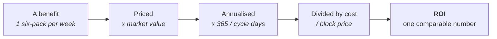
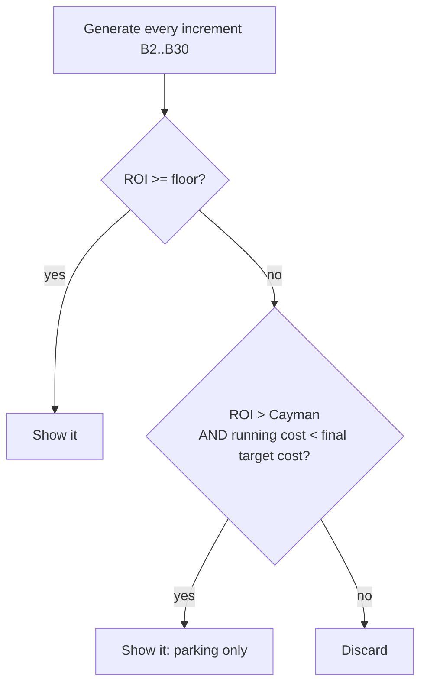
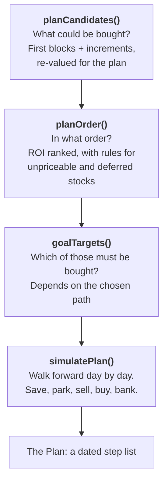
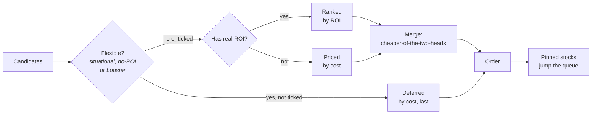
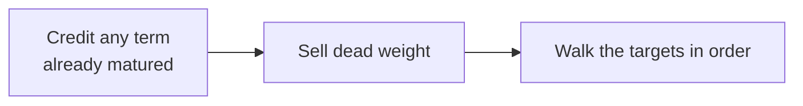
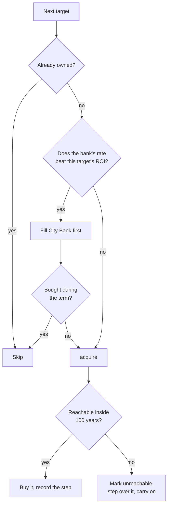
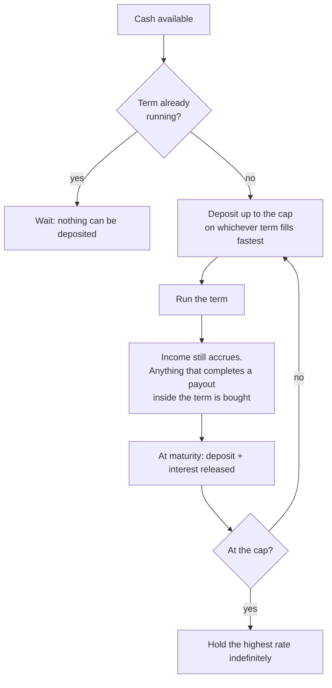

# How the planner thinks

_Reference for [autumn-grey.github.io](https://autumn-grey.github.io) · v0.8.0 · Updated: 2026-09-04_

**Disclaimer:** This Logic Explanation document was generated by Claude, the logic loops, formulas, etc. were my own design, but I have no idea what Claude has written below and just like the readme document, can't really be bothered to actually read it. It took long enough solving all these problems, ain't nobody got time to read about it afterwards

This document explains everything the app does between "here is a stock" and "buy this on day 47".
It is written to be read straight through in plain English. Formulas, diagrams and worked examples
sit alongside the prose, and most sections end with an **In the code** note naming the functions and
constants in `index.html` that implement it, so the same document works as a specification.

> **The one-sentence version.** Value everything as an annual return on its price, rank it, then
> walk a day-by-day simulation that buys each thing in turn as soon as it can afford it, buying
> cheaper investments along the way to earn money while it saves, and selling them when the real
> target comes into reach.

Everything below is detail on those two halves: **ranking** and **simulating**.

---

## Contents

1. [The one idea everything rests on](#1-the-one-idea-everything-rests-on)
2. [Turning a benefit into dollars](#2-turning-a-benefit-into-dollars)
3. [Increments: the doubling ladder](#3-increments-the-doubling-ladder)
4. [The banks](#4-the-banks)
5. [Private Islands](#5-private-islands)
6. [The stocks that can't be valued](#6-the-stocks-that-cant-be-valued)
7. [The two priority lists](#7-the-two-priority-lists)
8. [Ranking and the comparison columns](#8-ranking-and-the-comparison-columns)
9. [Which increments are worth showing](#9-which-increments-are-worth-showing)
10. [What the planner solves](#10-what-the-planner-solves)
11. [Step 1: Candidates](#11-step-1-candidates)
12. [Step 2: Order](#12-step-2-order)
13. [Step 3: Targets](#13-step-3-targets)
14. [Step 4: The simulation](#14-step-4-the-simulation)
15. [Parking: the core trick](#15-parking-the-core-trick)
16. [The City Bank routine](#16-the-city-bank-routine)
17. [The Total Newbie pathway](#17-the-total-newbie-pathway)
18. [Job point specials: the self-referential ones](#18-job-point-specials-the-self-referential-ones)
19. [The Investments table, and the rules it shares](#19-the-investments-table-and-the-rules-it-shares)
20. [What the model ignores](#20-what-the-model-ignores)
21. [Symbol and constant reference](#21-symbol-and-constant-reference)
22. [Appendix: how the file is put together](#22-appendix-how-the-file-is-put-together)

---

## 1. The one idea everything rests on

Torn gives you a dozen unrelated kinds of reward. A stock hands you a six-pack of beer every
week. Another hands you 100 energy. The bank hands you interest. An island stops you paying rent.
None of these are comparable to each other as they stand.

So the app converts every single one into the same number:

> **Annual return on investment**: the dollars a thing pays you back per year, divided by the
> dollars it cost to get.

```
roi = annual / cost
```

Once everything is expressed that way, a beer, an energy refill and a bank term can be lined up in
one list and sorted. Everything else follows from it. The rest of this document is either *how a particular benefit gets converted* or *what to do with the ranking once
you have it*.

Two supporting figures come from the same pair of numbers:

```
annual          = benefit × 365 / cycle_days
break_even_days = cost / (annual / 365)
```

The **benefit** is what one payout is worth. The **cycle** is how often it arrives: 7 days for most
stocks, 31 for the monthly ones, 1 for daily things, 365 for annual ones.



<details markdown="1">
<summary><b>In the code</b></summary>

Every investable thing becomes a flat **row** object with the same shape, built by `stockRows()`,
`bankRows()`, `islandRows()` and `caymanRow()` and assembled in `calculate()`:

```js
{ kind, ticker, name, block, cost, days, annual, roi, benefit, desc, tip, notes, ...flags }
```

`annual` is `null` when a benefit can't be priced; `roi` is `annual / cost`.
`breakEvenValue()` returns `Infinity` for anything that never pays for itself, so it sorts to the
far end rather than being treated as a blank.
</details>

---

## 2. Turning a benefit into dollars

Each stock's benefit type decides how it gets priced. There are seven types.

### Cash payouts

The easy case. The benefit *is* dollars, so the number is used as-is.

> Crude & Co pays $80,000,000 every 31 days.
> `annual = 80,000,000 × 365 / 31 = $942,000,000`

Two stocks use the cash type but represent **money you avoid spending** rather than money you
receive, so they are scaled by how much you use them:

| Stock | Benefit | Valued as |
|---|---|---|
| `YAZ` Yazoo | Free banner advertising, $500,000/day | `500,000 × banner_days_per_year / 365` |
| `MSG` Messaging Inc. | Free classified ads, $250,000 each | `250,000 × ads_per_month`, on a 31-day cycle |

Set a banner-day count of 0 and Yazoo is worth nothing, which is correct, because an unused
discount is not income.

### Item payouts

Priced at the item's current **market value**, pulled live from the Torn item list.

> Alcoholics Synonymous pays one Six-Pack of Alcohol per week.
> `annual = market_value_of_a_six_pack × 365 / 7`

`TCC` Torn City Clothing is the exception: it pays a *random* cosmetics cache, so it's valued at
the **mean market value of all eight cache types** (Gentleman, Elegant, Elderly, Denim, Wannabe,
Naughty, Cutesy, Injury).

### Boosters: happy, energy and nerve

A point of energy has no market price, so it is priced by substitution.

If the stock gives you 100 energy a week, the question is what you would have paid to get 100 energy
otherwise. You'd have bought Xanax. So the app asks which item you would use, looks up how much of that stat one of them gives and prices the benefit as the
number of items it saves you buying.

```
benefit = (stat_granted / stat_per_item) × item_market_price
```

> Mc Smoogle Corp gives 100 energy a week. Xanax gives 250 energy and costs, say, $800,000.
> `benefit = (100 / 250) × 800,000 = $320,000 per week`

Items with a **variable** effect (a range rather than a fixed number) are valued at the **midpoint**
of that range. Defaults are Erotic DVD for happy, Xanax for energy, Bottle of Beer for nerve, but
any refillable item can be chosen in Advanced view.

The three booster stocks are `EVL` (1,000 happy/week), `MCS` (100 energy/week) and `CBD`
(50 nerve/week).

### Points

`PTS` PointLess pays 100 points a week. Points have a live market, but individual listings are
noisy, so the app uses the **median** of all current listed prices rather than the mean or the
lowest ask.

```
benefit = 100 × median(listed_point_prices)
```

The median stops a single troll listing at $1 or $10,000,000 moving the figure.

### Viruses (`IIL` I Industries Ltd.)

I Industries halves virus coding time. That's not a payout, it's a rate increase, so the app values
it as *the extra virus output per day*.

It looks at every virus you have unlocked (from your Computer Science courses), works out
dollars-per-day for each and takes the best one:

```
benefit_per_day = max over unlocked viruses of
                  virus_market_value / (base_days × (1 - coding_time_reduction))
```

Coding time reductions from Software Engineering (20%) and Natural Language Engineering (10%) are
included. In Basic view, or when no courses are ticked, it assumes all virus courses are complete
and says so.

### "Other": the two bespoke ones

**`HRG` Home Retail Group** gives a random property every 31 days. A property you were given is only
worth what you can sell it back for, and estate agents pay **75%** of purchase price, unupgraded:

```
benefit = 0.75 × mean(all purchasable property prices)
```

**`ELT` Empty Lunchbox Traders** gives 10% off property *upgrades*, not off the property itself.
So it is worth 10% of the upgrade bill for however many islands you upgrade per year:

```
annual = 0.10 × PI_UPGRADE_TOTAL × islands_upgraded_per_year
```

The upgrade list totals **$1,452,788,000**, which is every upgrade the app prices, the Private
Yacht included. See [section 5](#5-private-islands).

### Bank bonus (`TCI`)

Covered in [section 4](#4-the-banks). It earns nothing on its own; it raises the rate on something
else.

<details markdown="1">
<summary><b>In the code</b></summary>

`stockRows()` branches on the stock's `type` field, which is index 3 of each `STOCKS[]` entry:
`"cash"`, `"item"`, `"happy"|"energy"|"nerve"`, `"points"`, `"virus"`, `"other"`, `"bankbonus"`,
`"unresolved"`.

Supporting functions: `selectedStat()` and `REFILLABLE_ITEMS` (booster item effects, with
`refillableEffect()` returning `{min,max,avg}`), `median()` (points), `bestVirusPerDay()` with
`VIRUSES` and `CODING_TIME_REDUCTIONS`, `PROPERTY_SELLBACK = 0.75` and `propertyPriceTable()`
(`HRG`), `PI_UPGRADE_COSTS` / `PI_UPGRADE_TOTAL` (`ELT`), `CLOTHING_CACHE_ITEMS` (`TCC`),
`NOT_A_PAYOUT = ["MSG","YAZ"]` and `PAYOUT_OVERRIDES = {PTS:"money", HRG:"items"}` for tagging.

A benefit that can't be priced falls through to `annual: null, roi: null` with a `desc` explaining
what's missing ("Needs points market price", "Select a nerve item with a positive measurable API
effect"), rather than silently showing zero.
</details>

---

## 3. Increments: the doubling ladder

Most stocks let you buy the benefit more than once. Each additional block is called an
**increment**: B1, B2, B3 and so on.

The rule Torn uses, and the app models exactly:

> **Each increment costs twice the previous one and pays exactly the same benefit.**

```
cost(Bn) = cost(B1) × 2^(n-1)
roi(Bn)  = roi(B1)  / 2^(n-1)
```

So the return halves every step. This is the single most important shape in the whole app:

| Block | Cost | ROI (relative) |
|---|---|---|
| B1 | 1x | 100% |
| B2 | 2x | 50% |
| B3 | 4x | 25% |
| B5 | 16x | 6.25% |
| B10 | 512x | 0.20% |

```
ROI
100% |*
     |
 50% |   *
     |
 25% |      *
12.5%|         *
 6%  |            *
 3%  |               *   *   *   *   *
     +---+---+---+---+---+---+---+---+---+---
       B1  B2  B3  B4  B5  B6  B7  B8  B9 B10
```

The practical consequence: **a B1 of something mediocre almost always beats a B4 of something
excellent.** Breadth before depth. This is why the default path is "one of everything", and why
the planner has to be careful about when a deep increment is ever worth buying (see
[section 9](#9-which-increments-are-worth-showing)). No rule pushes deep increments down the
order; the maths does it on its own.

Thirteen stocks have **no** increments at all. The benefit is a single block and that's it:
`ELT`, `IIL`, `IST`, `LOS`, `MSG`, `SYS`, `TCP`, `TGP`, `TCI`, `TCM`, `WSU`, `WLT`, `YAZ`.

<details markdown="1">
<summary><b>In the code</b></summary>

`SINGLE_BLOCK_TICKERS` lists the thirteen. Increment rows are generated in two places, kept
separate: `incrementRows()` for the Investments table (governed by the *Increments Shown* setting)
and inside `planCandidates()` for the planner (governed by the planner's own *Increments* setting).
Both use `cost = r.cost * Math.pow(2, n-1)` and reuse `r.annual` unchanged.

Base block share requirements come from `blockShares(ticker, fallback)`, which prefers the live
`torn/?selections=stocks` benefit requirement over the hardcoded value in `STOCKS[]`.
</details>

---

## 4. The banks

Two banks, two completely different shapes, and the difference between them drives most of the
planner's behaviour.

### City Bank: high rate, capped, locked

Five terms (1w, 2w, 1m, 2m, 3m), each with its own APR pulled live. Bonuses stack on the base rate:

```
apr = base_apr × (1 + 0.05 × merits) × (1.10 if TCI held) × ((72 + p) / 72)
```

where `merits` is your bank interest merits (0 to 10) and `p` your Oil Mogul job points per day
(see [section 18](#18-job-point-specials-the-self-referential-ones)). So ten bank merits and a TCI
block alone multiply Torn's published rate by 1.65.

Two things make it awkward, and both matter enormously later:

- **It is capped.** $2B normally, $3B with the Oil Rig *Fat Cat* special.
- **It locks.** Once deposited, the money is untouchable until the term matures.

### Cayman Islands Bank: lower rate, unlimited, liquid

Pays **0.5% monthly**, plus a faction bonus (0 to 25%) and the Oil Rig *Tax Haven* special (+10%),
compounding monthly:

```
apy = (1 + 0.005 × faction × oil)^12 - 1
```

At base rate that's **6.17% APY**, not 6%, because the compounding matters.

There's one subtlety the planner takes seriously: **Cayman pays interest on the lowest balance held
that month.** Money added mid-month earns nothing until the next one closes. So saving into Cayman
grows as

```
each month:  balance = balance + 30 × income
             balance = balance + balance_at_month_start × monthly_rate
```

That is interest on the month's *starting* balance, not the running total.

### Why the difference matters

| | City Bank | Cayman |
|---|---|---|
| Rate | Higher | Lower |
| Capacity | Capped ($2B / $3B) | Unlimited |
| Liquidity | Locked for a term | Withdraw any time |
| Role in the model | Something to fill, eventually | The **floor** every optional purchase is judged against |

> **Why Cayman and not the City Bank.** Cayman takes any amount, at any time, at a fixed rate. The
> City Bank is capped and locks for a term, so it cannot absorb the proceeds of a sale on demand
> and must never be used to judge a holding as dead weight, or to set the increment floor on the
> Investments table. This is the single most important rule in the app and it is easy to get wrong:
> three separate places once used the bank here, and all three produced plans that sold good stocks
> to fund worse ones.

### TCI: Torn City Investments

`TCI` adds **10% to your City Bank interest rate**. It produces no money on its own; it makes
another thing produce more. So it's valued as *the extra interest it causes*:

```
annual = deposit × apr × 0.10
```

It gets two rows, because there are two ways to play it:

- **Passive.** Buy the block and keep it. Costs the full block price, held all year.
- **Active.** TCI takes 7 days to activate but only has to be held *while the deposit is made*.
  So you buy it, wait a week, deposit, then sell it again. Capital is only tied up for
  `7 × 365 / term_days` days a year. The row's cost stays the real block price, because you still
  have to pay it, but the ROI reflects the shortened commitment:

```
roi_active = annual / (block_cost × (7 × 365 / term_days) / 365)
```

Because TCI's return derives from the bank rate, anything that raises the rate raises TCI with it,
Oil Mogul included.

On the Investments page, TCI is valued against whatever is in your bank **today**. The planner
values it differently (see [section 11](#11-step-1-candidates)).

<details markdown="1">
<summary><b>In the code</b></summary>

`bankRows()` builds one row per `BANK_TERMS` entry `{7:"1w", 14:"2w", 30:"1m", 60:"2m", 90:"3m"}`.
`caymanRow()` builds the Cayman row; `caymanMonthlyRate()` converts its annual yield back to a
monthly rate for the simulation. `daysToSave()` and `caymanBalance()` are exact mirrors of each
other, both using the monthly-low-balance model with `DAYS_PER_MONTH = 30`.

`bankDepositCap()` returns `3e9` with Fat Cat, else `2e9`. `bankTimeFactor()` supplies the Oil
Mogul multiplier. TCI's two rows are built in the `type === "bankbonus"` branch of `stockRows()`;
`exclusionGroup()` marks both the bank terms and the two TCI strategies as mutually exclusive, so
you can only hold one of each.
</details>

---

## 5. Private Islands

An island has two possible values, and they're mutually exclusive strategies rather than a sum:

| Strategy | Annual return |
|---|---|
| **Owner-occupy** | The rent you *stop paying*: `current PI rent/day × 365` |
| **Rent out** | The rent you *collect*: `PI rental price/day × 365` |

Cost is purchase price plus upgrades, after discounts that apply to different halves:

```
cost = island_price × (1 - 0.10 [Property Law])
     + PI_UPGRADE_TOTAL × (1 - 0.10 [ELT] - 0.10 [Interior Connections])
```

**Property Law discounts the property; ELT and Interior Connections discount the upgrades.**
Different bases, easy to conflate. And Torn stacks ELT with the Property Broker special
**additively**, so holding both is a flat 20% off, not 19%.

An island is **always costed fully upgraded**, and fully means every upgrade the app prices, the
Private Yacht included. The yacht is not optional and not a special case anywhere: the island cost,
ELT's discount value in [section 2](#2-turning-a-benefit-into-dollars), and the check that decides
whether an island read from the API counts as fully upgraded all use the same complete upgrade set
of ten.

Islands are the one thing the planner will **never sell**. Once bought, they stay bought, so they
can only ever appear as an acquisition and never as parking.

<details markdown="1">
<summary><b>In the code</b></summary>

`privateIslandCost(opts)` returns `{base, upgrades, total, note}` and takes overrides for
`propertyLaw`, `elt` and `broker` so the newbie pathway can price an island under different
assumptions. `islandRows()` emits the two strategies as `PI OWN` and `PI RENT`.
`piUpgradeDiscount()` returns the additive fraction. `PI_UPGRADE_COSTS` holds the ten upgrades and
`PI_UPGRADE_TOTAL` their sum; `PI_FULL_UPGRADES` is the count of them, which is what
`privateIslandsFrom()` compares a property's `modifications` list against.
`PROPERTY_LAW_COURSE = "edu_law_property_law"`.
</details>

---

## 6. The stocks that can't be valued

Nine stocks have a benefit with no defensible dollar figure. Rather than invent one, the app puts
them in their own table with cost and notes, and excludes them from ranking:

| | Benefit | Why it resists valuation |
|---|---|---|
| `WSU` West Side University | −10% course time | Shows *time saved*, but time isn't money at a fixed rate |
| `IST` International School TC | Free education courses | Shows *money saved* on remaining courses, but only once |
| `TCM` Torn City Motors | +10% racing skill | No cash equivalent |
| `WLT` Wind Lines Travel | Private jet, −50% travel time | No cash equivalent |
| `BAG` Big Al's Gun Shop | Ammo pack based on equipped weapon | Payout depends on your loadout |
| `LOS` Lo Squalo Waste | +25% mission credits and money | Nobody's costed mission credits yet |
| `TCP` TC Media Productions | Company sales boost | Depends entirely on your company |
| `TGP` Tell Group Plc. | Company advertising boost | Same |
| `SYS` Syscore MFG | Advanced firewall | Defensive, not productive |

Two of them do get a **helper figure** even though they get no ROI: `IST` shows the total cost of
your remaining courses, and `WSU` shows how much time its 10% would save you. Both read straight
from the education checklist.

These stocks are never ranked and never used as parking. The planner only buys them if you tick or
pin them, at which point it ranks them **by price**, cheapest first, since price is the only
number available.

`IST` is flagged as the app's only **Awful** stock and is sorted to the very back even when pinned.

> The author's standing offer: work out a defensible ROI for any of these and you get a xanax
> and a kiss.

<details markdown="1">
<summary><b>In the code</b></summary>

`UNDEFINED_ROI_TICKERS` drives the second table in `render()`. `AWFUL_TICKERS = ["IST"]` and
`DUD_TICKER = "IST"` with `window.dudPinned` sending it to `Infinity` rank in `planOrder()`.
`remainingCourseCost()` and `remainingCourseDays()` supply the `IST` and `WSU` helper lines.
</details>

---

## 7. The two priority lists

There are two lists of stocks with tickboxes, on two different pages, and they do **different
jobs**. They are easy to confuse.

| | **Prioritise** | **Situational Stocks** |
|---|---|---|
| Where | Investments page, *Investment Preferences* panel | Planner page |
| What's in it | Five stocks: `EVL`, `MCS`, `CBD`, `YAZ`, `MSG` | Every plannable stock |
| Class in the DOM | `.pref-prio` | `.plan-prio` |
| What unticking does | Multiplies the stock's **ranking** ROI by `DEPRIORITISE_WEIGHT` so it sinks in the table's sort order. Nothing else. | Defers the stock in the **planner**: it goes to the very back of the order, cheapest first, and never gets increments |
| Affects the planner? | **No** | **Yes** |
| Affects the table's sort? | **Yes** | No |

`prioritisedTickers()` reads `.plan-prio`, the planner's list. The Investments page's list is read
by its own pair of helpers and never reaches `planOrder()`.

**Prioritise** exists because a few benefits are only worth their face value if you use them. Free
banner advertising is worth $500,000 a day to someone running banners and $0 to everyone else.
Unticking one there is careful about what it changes:

- **Displayed figures are unchanged.** The cost, return and ROI shown stay as they are.
- **Ranking ROI is multiplied by 0.0001.** That is what moves it.

```
rank_roi = roi × 0.0001   if deprioritised
         = roi           otherwise
```

The effect: it sinks to the bottom of every sort, drops out of "Buy this next", and disappears from
the bank-advice line. *Displayed* and *ranked* value are separate on purpose. The number you see is the truth about the
stock; the ranking is the truth about your priorities.

**Situational Stocks** is the one the plan obeys, and it is also where pinning happens
(see [section 12](#12-step-2-order)).

<details markdown="1">
<summary><b>In the code</b></summary>

`rankRoi()` applies `DEPRIORITISE_WEIGHT = 0.0001` and reads the `.pref-prio` checkboxes.
`prioritisedTickers()` and `deferredTickers()` read `.plan-prio`, built by `buildPlanPrioritise()`
from `plannableStocks()`. Both lists persist: `tornInvPrio` for the planner's,
`tornInvStockPrio` for the table's.
</details>

---

## 8. Ranking and the comparison columns

### Sorting

The table sorts on any of Investment, Cost, Return, ROI, Break-even or City Bank difference. Rows
with no value sort as `-Infinity` so they land at one end rather than scattering.

### The City Bank difference column

The most useful column on the page and the least obvious. It answers: **how much better off are
you buying this instead of putting the same money in the bank?**

```
difference = annual - (city_bank_apr × cost)
```

A positive number means the investment beats the bank on that capital. The term used for the
comparison is selectable in the column header, from 7 days to 3 months.

### Buy this next

The card above the table. It takes the highest-ranked thing you don't own, then asks a second
question: **can you afford something cheaper in the meantime that you'd sell to help fund it?**

If yes, it recommends the cheapest such parking buy and tells you what it's saving towards. If no,
it recommends the target directly. It respects exclusion groups, so it never suggests two City Bank
terms or both TCI strategies, and banks are never suggested as a purchase at all: they surface
through the separate bank advice line below, which lists everything out-ranking the best bank term
by name and then says capital belongs in the bank after those. That line disappears once a term is
marked owned and the deposit is at its cap.

<details markdown="1">
<summary><b>In the code</b></summary>

The comparison column is computed in `calculate()` against the term chosen in `#compareTermTable`.
`bestBuy()` and `bankAdviceText()` build the card, `renderBuyNext()` draws it, `exclusionGroup()`
supplies the mutual-exclusion rule.
</details>

---

## 9. Which increments are worth showing

Set *Increments* to a number and you get exactly that many, no argument. Set it to **Optimum** and
the app has to decide, which needs an actual rule.

The reasoning runs like this:

**Work out where the buying stops.** Going down the ROI ranking, the last first block you'd ever
bother with is the weakest one that's still profitable. Call that the **final target**. Anything
ranked above it, you'd buy on the way.

**So show every increment that ranks at or above the final target's ROI.** Those are increments
you would reach before you were finished.

**Then add the parking candidates.** While saving for the final target, spare cash can sit in
something cheap that you'd sell later. Those are worth showing too, but only if they're better than
leaving the money in Cayman, and their combined cost stays under the final target's price. If it
didn't, you'd have just bought the target.

The bar is therefore whichever is *higher*: the weakest first block still being bought, or Cayman.

```
floor = max( roi_of_final_target , roi_of_cayman )
```

**This is the same floor the planner uses**, in [section 14](#14-step-4-the-simulation). The two
must agree, and when they have drifted apart the table has recommended things the plan then refused
to buy.



Two path overrides sit on top of this: **Path to 1000E** forces Mc Smoogle to B10 regardless,
because ten blocks is what makes 1,000 energy, and **No strategy** shows first blocks only, because
with no ranking there's nothing to reason from.

<details markdown="1">
<summary><b>In the code</b></summary>

`incrementRows(firstBlocks, seeds)`. The pool is generated to B30 but breaks early once a block is
both below the floor and above budget. `caymanRow().roi` supplies the Cayman comparison.
Deprioritised stocks get `capFor(s) === 0` and produce no increments at all.
</details>

---

## 10. What the planner solves

The Investments table answers *what is worth buying*. The planner answers a harder question:

> Given this much cash and this much budget per day, **in what order** do I buy things, and
> **when** does each one happen?

That's harder because of a chicken-and-egg problem: what you buy changes your income, which changes
how fast you can afford the next thing, which changes what you should buy. There's no closed-form
answer, so the app **simulates forward day by day**.

Four stages:



Two ceilings keep it terminating, and **they do not behave the same way**:

| Guard | Value | What it does |
|---|---|---|
| `PLAN_MAX_DAYS` | 36,500 (100 years) | A target that can't be reached inside it is marked unreachable and **stepped over**. The plan carries on with everything else. |
| `PLAN_MAX_ACTIONS` | 2,000 | Hard stop. The plan is flagged truncated. |

Running out of *reach* is normal and non-fatal. Running out of *actions* is the only thing that
ends a plan early. These are safety limits, not display limits: the output is paged, so a plan can
be as long as it needs to be.

---

## 11. Step 1: Candidates

Everything that could possibly be bought, with three re-valuations that only apply inside the plan.

**TCI is re-valued against the cap, not today's balance.** On the Investments page, TCI is worth
10% of the interest on whatever is in your bank right now, which for most people is nothing much.
But the plan is *going to fill that bank*, and once it's full the block is worth many times more.
Valuing it at today's balance had the planner buying TCI last, or not rating it at all. So in the
plan:

```
annual(TCI) = bank_cap × base_apr × 0.10
```

**Increments are regenerated**, not reused from the table, so the planner's own *Increments*
setting governs them independently.

**Unreachable increments are pruned.** The ladder doubles, so B12 is 2,048 times the first block,
or hundreds of billions. Left unchecked, the simulation spends its entire hundred-year horizon
failing to save for a block it can never afford. So anything past what your money could ever reach
isn't generated:

```
reach = 3 × (capital + max(0, daily_budget) × 36,500)
```

The 3x leaves room for interest and for the returns of everything bought along the way. A depth you
asked for explicitly, through a ticked Plan checkbox or a path that requires it, is **never** pruned.

Private Islands appear only if their checkbox is ticked, and since they are never sold they can only
ever be acquisitions, never parking. TCI appears once, as whichever of Passive or Active is
selected.

<details markdown="1">
<summary><b>In the code</b></summary>

`planCandidates()`. `wantDepth{}` records forced depths per path: `selected` reads
`window.selectedRows`, `stock` uses `#planTargetBlock`, `increments` applies the picked block to
every incrementable stock, `energy1000` forces `MCS` to 10. The generation loop breaks when
`(roi < floor || cost > reach) && n > need`.
</details>

---

## 12. Step 2: Order

Candidates are split into three streams and merged.



**Ranked.** Anything with a real, positive ROI, sorted by ROI descending. This is the backbone.

**Priced.** Ticked stocks with no measurable ROI. They can't be ranked on return, so they're ranked
on **price**, cheapest first.

**Deferred.** Situational, unpriceable and booster stocks you have *unticked* in the planner's
Situational Stocks list. Their benefit is only worth its value if you use it, so unticking one says
"I won't". They go to the very back, cheapest first, and never get increments or get used as
parking.

### The merge rule

Ranked and priced are interleaved by this rule:

> A no-ROI stock moves ahead of the next ranked investment as soon as it costs less than it.

```
while either pile has items:
    if priced[j].cost < ranked[i].cost:  take priced[j]
    else:                                take ranked[i]
```

The logic being that if you've said you want it and it's cheap, buying it now costs you almost
nothing in delayed returns. This is the one place price beats return. It is why Torn City
Motors ($306.8m, no ROI) lands immediately before Symbiotic Ltd. ($370.8m, 60%): TCM is cheaper, so
it goes first. **Whether that is the right trade-off is a judgement call, not a fact**, and it has
not been settled.

### Pinned no-ROI stocks

A stock with no calculable ROI can't be ranked on return, so the Situational Stocks list lets you
*pin* one by clicking its name. Pinning says outright *this is what the plan is for*, and overrides
everything above:

```
rank(r) = 0..n-1   if r is pinned      (cheapest pinned first)
        = n        otherwise           (keeps the order worked out above)
        = Infinity if r is IST and IST is pinned
```

The sort is stable, so unpinned investments keep their relative order exactly. Pinning also ticks
that stock's checkbox, since planning first for something the plan was told to skip would
contradict itself. Unticking drops the pin; unpinning leaves the tick alone.

`IST` is the one exception, hardcoded as `DUD_TICKER`: pinning it outlines it red, floats
"Why would you -.-" over it, and sends it to the very back of the order, behind even the unticked
stocks.

### One demotion that happens later

During the simulation, a ticked `WSU` keeps its place only while there are still courses left to
shorten. Once the simulated day passes your education completion date it drops to the back with the
other no-ROI stocks, because a course-time discount is worth nothing when you have no courses left.

<details markdown="1">
<summary><b>In the code</b></summary>

`planOrder()`, `isFlexibleStock()`, `deferredTickers()`, `pinnedOrder()`. The merge is a standard
two-pointer walk taking whichever head is cheaper. The WSU demotion is in `simulatePlan()` via
`educationRemainingDays()`.
</details>

---

## 13. Step 3: Targets

The order says *what's best*. The path says *what you want*. `goalTargets()` filters one
by the other. `beatsCayman(r)` below means `r.roi > cayman_roi`.

The universal rule underneath all seven paths: **everything that beats Cayman is worth owning on
any path.** Below that line the money is better left in the bank, and only a path with a reason of
its own goes further.

| Path | Targets |
|---|---|
| **One of Everything** | The whole order, unchanged. |
| **A Certain Investment** | The order truncated at the chosen ticker and increment, so everything better comes first, then it stops. |
| **Custom Plan** | Only rows ticked in the **Plan** column. A ticked increment brings the blocks under it along: B3 means buying B1 and B2 too. Everything else the plan buys is parking. |
| **1000 Energy** | Mc Smoogle Corp up to B10, plus anything that beats Cayman, plus a first block of each *ticked* situational stock. |
| **Just Give Me Money** | `beatsCayman(r) && !isFlexibleStock(r)`. Situational and booster stocks are excluded entirely, whatever their ROI, because that figure is the cash *value* of a benefit rather than cash, and this path is for people who want actual money. |
| **Increment Amount** | The whole order, with the increment ladder capped by the dropdown. |
| **Total Newbie** | The whole order, under the newbie ruleset ([section 17](#17-the-total-newbie-pathway)). |

<details markdown="1">
<summary><b>In the code</b></summary>

`goalTargets(order)`, with `passiveFloor()` supplying the Cayman benchmark, or `-Infinity` when
Cayman is switched off in *Other Investments*. `beatsCayman()` is the shared predicate.
</details>

---

## 14. Step 4: The simulation

Now the clock starts. `simulatePlan()` walks forward from day 0, carrying:

| | |
|---|---|
| `day` | Simulated days from today |
| `cash` | Liquid money |
| `owned` | What is held, seeded from your Investments-page marks |
| `held` | Holdings that are earning, each optionally claimed by a future purchase |
| `bankHeld` / `pendingBank` | City Bank balance, and a locked term waiting to mature |

Daily income is:

```
income() = daily_budget_setting
         + sum of returns of everything currently held
         + bank interest, but only once the bank is at its cap
```

While the bank is still filling, its interest is credited as a lump at maturity instead, since
counting both would double it. Income is recomputed every time it's needed, never cached, which is
what makes the plan accelerate as it goes: each purchase raises the income that funds the next one.

### 14.1 Opening moves



**Sell dead weight.** If you already hold something that earns less than the weakest thing the plan
intends to buy, that money is doing worse work than it could be, so it's sold at day 0 to fund the
rest. The bar is:

```
bar = max( weakest unowned first-block target with roi > 0 ,
           cayman_roi if Cayman is enabled )
```

Judged against **first blocks only**, not increments, because a deep increment's thin return would
drag the bar so low that nothing ever looked inefficient. Holdings with no measurable return are
left alone, since their worth isn't in this model, and islands are never sold.

Cayman can raise this bar. **The City Bank cannot**, for the reason given in
[section 4](#4-the-banks).

### 14.2 The main loop

For each target, in order:



The bank is only filled **once the target no longer beats the bank's rate**. That is what stops
capital being locked away while something better is waiting, and it is why bank steps cluster
around the low-ROI targets in a plan.

### 14.3 Acquiring

`acquire()` is recursive: *a purchase made to fund another purchase is planned exactly like any
other purchase*, so the nesting comes out of the recursion rather than being special-cased.

```
acquire(target):
    loop (max 8):
        wait = waitFor(target)
        if wait <= 0: break
        pick = bestParking(target, wait)
        if no pick: break
        acquire(pick)          <- recursion; this is where nesting comes from
        claim pick for target
    advance the clock by the final wait
    sell everything claimed for this target
    buy the target
```

**How long to wait**, in `waitFor()`:

```
needed = target.cost - resale value of things already claimed for it
wait   = time to save `needed` from `cash` at the current income
```

with one refinement: if a bank term is still running, waiting for it to mature can beat saving the
whole sum, so the shorter of the two is used.

### 14.4 Closing moves

1. Wait out any term still running, so the money it returns is put to work rather than left
   dangling off the end of the plan.
2. Anything still uninvested goes into the City Bank.
3. Whatever is left after that goes to Cayman as a final step.

<details markdown="1">
<summary><b>In the code</b></summary>

`simulatePlan()`. `sellDeadWeight()` runs once after `creditMaturedBank()`. `runTarget()` is the
per-target entry point, `acquire(target, parentOcc, depth)` the recursive purchase routine,
`runCityBank(remaining)` the banking routine. Each step carries an `occId` and optional
`parentOcc`/`depth`, which is what produces the nested, foldable step display. `SELL_FEE = 0.001`.
</details>

---

## 15. Parking: the core trick

Suppose the next thing worth buying costs $500M and you have $50M with $5M/day coming in. That's
90 days of saving. Leaving $50M idle for 90 days is a waste, but so is buying something you'd have
to sell at a loss.

**Parking** is buying something cheap in the meantime, collecting its payouts and selling it to
help fund the real target.

```
Day 0                                                      Day 90
+----------------------------------------------------------+
|  Buy TCT B1 ($8M)                                         |
|    +-- collects 12 monthly payouts ----------------------+|
|                                          Sell it (-0.1%)  |
|                                          Buy the target   |
```

It only makes sense if the payouts beat the sale fee. `bestParking()` scores each candidate on what
it nets over the wait and takes the best:

```
net = floor(hold_days / cycle_days) × payout_per_cycle - cost × 0.001
```

and only considers candidates that are:

- not already owned, not the target itself, not deferred;
- **stocks**, because islands are never sold and so never parked;
- **better than Cayman**, which beats a weak park with no sale fee at all;
- **cheaper than the target**, because parking in something more expensive than the thing you're
  saving for is not saving;
- **paying out at least one full cycle** before the sale. Half a cycle pays nothing.

The last two conditions are what stop the plan buying and flipping things pointlessly. `0.001` is
Torn's sale fee, charged on the purchase price.

**Buying a parking stock is itself a purchase**, so it goes through the same `acquire()` routine.
The planner can therefore park while saving for a park, and the nesting in the step list, steps
indented under steps, comes out of that recursion.

Once the target is bought its parking is liquidated in the same step. The payouts collected while
holding are already in `cash`, because a parked stock sits in `held` and `income()` has been
counting it every day.

<details markdown="1">
<summary><b>In the code</b></summary>

`bestParking(target, wait, forOcc)` scores and picks; `acquire()` loops it up to 8 times per target.
`waitFor()` computes days-to-affordability, netting off what will be sold; counting the resale both
there and again at purchase time was handing out the parked stock's value twice.
`saveTime()` routes through `daysToSave()` when Cayman is on. `heldFor(occ)` / `resaleOf(list)`
track the parking assigned to each acquisition.
</details>

---

## 16. The City Bank routine

The City Bank isn't bought, it's *filled*. Once nothing left to buy beats its rate, the routine
runs:



During the term, income keeps accruing as cash even though the deposit is locked, so anything that
completes a full payout cycle before maturity is bought along the way. Deferred stocks are excluded
from that list: being cheap enough to afford mid-term is not a reason to jump the queue ahead of
what you asked for.

### Two questions, two different answers

The routine picks its term differently depending on where it is:

> **While filling**, a *shorter* term beats a higher rate. Income can only be deposited when a term
> matures, so a long lock leaves it idle. The app simulates every unlocked term forward and picks
> whichever reaches the cap soonest.
>
> **Once full**, nothing more can go in, so interest overflows as cash and never compounds. The
> yield is the APR, and the highest one wins.

A 90-day term at a slightly better rate can be strictly worse than a 7-day one while you are still
filling. Anyone "correcting" the fill logic to pick the best rate would be introducing a bug.

### TCI Active inside the routine

If you've chosen the Active strategy, TCI isn't bought outright; the bank routine borrows it. Just
before a deposit it checks whether a week out of the bank is worth the 10%:

```
gain = projected_deposit × base_apr × 0.10 × horizon / 365
cost = projected_deposit × apr × 7 / 365     (interest lost while waiting)
     + block_cost × 0.001                    (sale fee)
```

Buy only if `gain > cost`. The horizon is a full year if this deposit caps the bank, because a
capped deposit keeps its rate indefinitely, and a single term if it's still filling. Once the
deposit is made and the rate is locked in, the block has done its job and is sold.

The Passive block is kept, so from the moment it's bought every deposit earns the bonus rate.
Its worth is counted there rather than as income of its own, which would be the same money twice.

<details markdown="1">
<summary><b>In the code</b></summary>

`runCityBank(remaining)`. `fastestFillTerm(cash, income, cap)`, and `fastestFillOptionAt()` on the
newbie path, simulate each term forward to answer the fill question; `bestCityBankTerm()` answers
the full one. `bankRoiFor(row)` divides out the Investments-page TCI checkbox so the 10% can't be
applied twice. `TCI_ACTIVATION_DAYS = 7`. `creditMaturedBank()` is called wherever the clock moves.
</details>

---

## 17. The Total Newbie pathway

Every other path assumes your current account. This one assumes a brand-new one and simulates the
account *growing* alongside the money, which changes the answers, because rates that are fixed for
you aren't fixed for someone starting out.

What it re-derives at each simulated day rather than reading from settings:

**Bank terms unlock in sequence.** The 1-week term is available immediately; each longer term only
opens once a full term of the next-shortest has run to completion. Cumulatively: 1w at day 0,
2w at day 7, 1m at day 21, 2m at day 51, 3m at day 111. If you already have a term running, the
app credits you the terms you plainly have rather than making you re-earn them.

**Merits arrive on a schedule**: 0 until a week has been banked, then 6, 8 and 10 at the one-, two-
and three-week marks. The bank APR is recomputed at whatever the merit count is *on that day*.

**No perks at all.** No TCI, no Fat Cat (so the cap is $2B, not $3B), no Oil Rig, no faction Cayman
bonus, no job point specials. Cayman is a flat 0.5% monthly.

**Two timed unlocks**, because some things are not available yet:

| | Assumed at | Effect |
|---|---|---|
| Computer Science courses | day 360 | `IIL` is *valued* as if all virus courses were done, but can't be *bought* until then |
| Property Law | day 720 | A Private Island is priced at the 10% discount and gated until then |

The split between valuing and gating matters: `planCandidates()` prices them as they'll be, so they
rank correctly, and `waitFor()` holds the actual purchase back to the unlock day.

The stated goal is zero to multi-billionaire, aiming at the Monopoly merit by the most profitable
route available.

<details markdown="1">
<summary><b>In the code</b></summary>

`newbieActive()`, `newbieTermUnlockDays()`, `newbieMeritsAt(day)`, `newbieBankAprAt(term, day)`,
`bankOptionsAt(day)`, `bestBankOptionAt(day)`, `fastestFillOptionAt()`, `newbieCaymanMonthlyRate()`,
`newbieCaymanAnnualRoi()`. Gates: `NEWBIE_IIL_UNLOCK_DAY = 360`, `NEWBIE_PROPERTY_LAW_DAY = 720`.
</details>

---

## 18. Job point specials: the self-referential ones

Two company specials spend job points to shorten a timer that's already running, and both are
circular: points accrue *per day*, so how long the timer runs decides how many points you get,
which decides how much it's shortened, which decides how long it runs.

It solves in one line of algebra rather than by iteration.

**Oil Mogul** (Oil Rig 5★): 3 job points buy one hour off a bank term. With a nominal term of `T`
days and `p` points per day, the real duration `D` satisfies:

```
D = T - (p × D / 3) / 24        hours bought, converted to days
D × (1 + p/72) = T
D = 72T / (72 + p)
```

The term finishes in `D` days but pays the full `T` days of interest. So the *effective* APR is
scaled by `T/D`:

```
apr_effective = apr × (72 + p) / 72
```

At 10 points a day that's a **13.9% uplift** on the rate, not from a higher rate but purely from
the same interest arriving sooner. That single factor is all the rest of the app needs, so it drops
into `bankRows()` alongside the merit and TCI multipliers, which is why Oil Mogul appears as a
multiplier in the APR formula in [section 4](#4-the-banks) rather than as a separate mechanic. TCI's
ROI derives from the bank rate, so it rises with it.

**Education** (Fitness Centre 1★ *Healthy Mind*, Hair Salon 7★ *Cutting Corners*): 1 point buys
30 minutes off a course. Same shape, different constant:

```
D = 48R / (48 + q)
```

where `R` is the remaining course time after merits, WSU and the job perk.

Both hold for point rates that don't divide evenly, because leftover points roll to the next day
rather than being lost, so the average rate is what matters and not the integer count. **Checked
against a step-by-step simulation that spends points as whole units: the two agree to within
0.03 days across every term length and rate.**

**Interior Connections** (Property Broker 10★) is the third special and is not self-referential at
all: a passive 10% off property upgrades, stacking additively with an owned ELT block for a flat
20%.

Job points per day equal the company's star rating. A refresh sets all three controls from
`company_type` and the star rating, matched on Torn's type ids rather than the company name, which
a director can change.

### While we're here: education time

Course reductions **stack on the base time** rather than compounding, which is why WSU always saves
the same 10% whatever your merits are:

```
remaining_days = base_days
               × (1 - 0.02 × merits - 0.10 [WSU] - 0.10 [job perk])
               × 48 / (48 + q)
```

capped at a 90% total reduction. This figure drives `IST`'s and `WSU`'s helper numbers and the day
at which a ticked `WSU` gets demoted in the plan.

<details markdown="1">
<summary><b>In the code</b></summary>

`JP_PER_BANK_HOUR = 3`, `EDU_HOURS_PER_JP = 0.5`, `bankTermRealDays()`, `bankTimeFactor()`,
`educationJpFactor()`, `educationTimeReduction()` with `EDU_MERIT_REDUCTION = 0.02`,
`educationRemainingDays()`. The derivation above is reproduced in a comment block above
`JP_PER_BANK_HOUR`.
</details>

---

## 19. The Investments table, and the rules it shares

Two pieces of the table run the planner's logic and **must agree with it**. When they have drifted
apart, the table has recommended purchases the planner then declined to make.

1. **Which increments are shown on Optimum** uses the same `floor` as
   [section 9](#9-which-increments-are-worth-showing), which is the same bar the simulation uses to
   sell dead weight in [section 14](#14-step-4-the-simulation).
2. **Buy this next** ranks on *ranked* ROI, so deprioritised stocks sink, and respects the same
   exclusion groups the planner does.

Both are floored by **Cayman only**, never the City Bank. If you change one, change the other, and
re-read [section 4](#4-the-banks) first.

---

## 20. What the model ignores

**Share price movement.** Only benefit payouts count. Capital gains and losses are excluded on
purpose, because past performance isn't a reliable indicator of future outcomes, and a planner that
assumed otherwise would be making promises it can't keep.

**Resale value equals purchase price**, less the 0.1% sell fee. Parking a block and selling it on is
therefore modelled as free of price risk. This follows from "prices hold", but it bites hardest
here, and it is what the plan note means by that phrase.

**Everything is a snapshot.** Item prices, point prices, share prices and bank rates are accurate at
the moment of refresh and move afterwards.

**Randomness is averaged.** `HRG`'s random property and `TCC`'s random cache are valued at their
means. Over a long run that's right; for any single payout it isn't.

**Your own earnings never rise.** `income()` is the daily budget plus the return on what you already
hold. Growth comes entirely from the portfolio: no job, crime or rent increase is modelled. The
field's help text says so.

**Saving is compounded in 30-day steps** (`DAYS_PER_MONTH`) while durations are *displayed* using
real calendar months. A "3 month" wait is 90 days in the maths and a true quarter on screen; the two
differ by a couple of days.

**Benefits you don't use are still valued** unless you untick them. That's what the two lists in
[section 7](#7-the-two-priority-lists) are for. Note that the tag key on the Investments page says
so, but the planner's Situational Stocks list, where the ticking happens, does not.

**A pinned no-ROI stock is worth buying first**, whatever it delays. Pinning is the user asserting
that, so the planner doesn't second-guess it, but the cost is real and it is not shown anywhere.

**Job point specials are assumed to be spent on the timer, every day.** The maths in
[section 18](#18-job-point-specials-the-self-referential-ones) takes the full daily rate as going to
the bank or to study. Spend the points on anything else and the real term is longer than modelled.

**A race history stands in for a racing licence.** There is no API field for holding one, so `TCM`
is ticked when `user > races` returns anything. Someone who bought a licence but has never raced
reads as not having it.

**Torn reports modifications only to a property's owner**, so the upgrade state of an island you
rent in cannot be read, and is not checked or reported.

**Torn does not report bank term lengths**, only the time remaining, so the term is inferred from a
high-water mark and can be overridden by hand. The dropdown says so in its help line, since it
otherwise reads as fact.

**PI upgrade costs are hardcoded.** No Torn selection exposes them.

**The education job perk's top tier** (a further 10%) isn't modelled.

**The nine unpriceable stocks** stay unpriceable. Ranking them on price is a fallback, not a
valuation.

**The merge rule in [section 12](#12-step-2-order) is unsettled.** A cheap no-ROI stock currently
jumps ahead of a more expensive one with a real return. Three alternatives have been considered and
none chosen.

**Parking churn is a known wart.** A plan can spend hundreds of steps buying and reselling the same
block. Each round trip is profitable after the fee, but it is unreadable, and nothing caps or
collapses it yet.

**The plan is a route, not a schedule.** Every day count assumes your stated daily budget holds
steady and that you follow the steps. It is a guide.

---

## 21. Symbol and constant reference

| Symbol | Meaning |
|---|---|
| `benefit` | Dollar value of one payout |
| `cycle_days` | Days between payouts (7, 31, 1, 365 and so on) |
| `annual` | `benefit × 365 / cycle_days` |
| `roi` | `annual / cost` |
| `Bn` | Benefit block / increment number *n* |
| `merits` | Bank interest merits, 0 to 10 |
| `p` | Oil Mogul job points per day, 0 to 10 |
| `q` | Education-special job points per day, 0 to 10 |
| `faction` | Faction Cayman bonus multiplier, 1 to 1.25 |
| `oil` | Oil Rig Tax Haven multiplier, 1 or 1.10 |
| `R` | Remaining course days before the job-point reduction |

### Constants

| Name | Value | Meaning |
|---|---|---|
| Increment cost multiplier | `2^(n-1)` | Torn's doubling ladder |
| `SELL_FEE` | 0.001 | Torn's 0.1% sale fee, on the purchase price |
| `DAYS_PER_MONTH` | 30 | Cayman's compounding period |
| `TCI_ACTIVATION_DAYS` | 7 | How long TCI must be held to lock the bonus |
| `DEPRIORITISE_WEIGHT` | 0.0001 | Sort-only demotion on the Investments table |
| `PLAN_MAX_DAYS` | 36,500 | 100-year horizon. Unreachable targets are stepped over, not fatal |
| `PLAN_MAX_ACTIONS` | 2,000 | Step limit. This one truncates the plan |
| `JP_PER_BANK_HOUR` | 3 | Job points that buy one hour off a bank term |
| `EDU_HOURS_PER_JP` | 0.5 | Hours off a course per job point |
| `EDU_MERIT_REDUCTION` | 0.02 | Course time saved per education merit |
| `PROPERTY_SELLBACK` | 0.75 | What an estate agent pays for a property |
| `PI_FULL_UPGRADES` | 10 | Every upgrade the app prices, the yacht included |
| PI upgrades total | $1,452,788,000 | Sum of `PI_UPGRADE_COSTS` |
| City Bank cap | $2B, or $3B with Fat Cat | `bankDepositCap()` |
| Cayman base rate | 0.5% monthly, compounding to 6.17% APY | Before faction and Tax Haven bonuses |
| Bank multiplier | `(1 + 0.05 × merits) × 1.10 [TCI] × (72+p)/72 [Oil Mogul]` | Applied to Torn's published rate |

---

## 22. Appendix: how the file is put together

Everything is one self-contained `index.html`: markup, CSS and vanilla JavaScript, no build step and
no dependencies. Top to bottom:

```
<style>          dark theme, CSS custom properties on :root
<header>         title, page switch, Basic/Advanced toggle
#pageInvestments config column + tables
#pagePlanner     position, path config, plan output
#pageDocs        cards linking out to the four built doc pages
#pageTos         Terms of Service and Kudos
<script>
   |- DATA          STOCKS[], course tables, property prices, tag lists, constants
   |- HELPERS       $(), money formatting, duration formatting, problem log
   |- PERSISTENCE   loadLocal / saveLocal / clearLocal, market cache
   |- API           torn(), fetchStocks/Items/Rates/Points/Meta/Education/Properties
   |- USER DATA     verifyFaction, fetchUserData, applyUserData, perk parsing
   |- ROW BUILDERS  stockRows, incrementRows, bankRows, islandRows, caymanRow
   |- SELECTION     rowKey, ownership/skip/select sets, undo stack
   |- RENDER        calculate -> render -> renderPlan, tables, totals, buy-next
   +- PLANNER       planCandidates -> planOrder -> goalTargets -> simulatePlan
```

Routing is by URL hash (`#investments`, `#planner`, `#docs`, `#tos`), handled by `setPage()` with a
`hashchange` listener. Only one `.page` div is visible at a time.

The central data structure is the **row** from [section 1](#1-the-one-idea-everything-rests-on).
`calculate()` rebuilds every row from current settings and re-renders, and runs on every input
change, so it is kept cheap. `rowKey()` gives each row a stable identity so ownership and
selection survive a rebuild.

### Where the numbers come from

| Endpoint | Used for |
|---|---|
| `tornsy.com/api/...` | Live stock prices, used instead of Torn's own to cut API request count |
| `torn/?selections=stocks` | Benefit block share requirements |
| `torn/?selections=bank` | City Bank base APRs per term |
| `torn/?selections=items` | Item market values |
| `torn/?selections=education` | Course durations and costs, self-calibrating against the built-in week table |
| `torn/?selections=properties` | Property purchase prices |
| `market/?selections=pointsmarket` | Median listed point price, which values `PTS` |
| `user/...`, `company/...` | Personal preconfiguration, customised key only |

Each live table overlays a hardcoded fallback, so the app still works before a refresh, or on a key
without the `torn` selections. Anything the API supplies wins.

Any request that fails is logged to the collapsible problems panel under the status line rather than
thrown away, and `window.onerror` and `unhandledrejection` feed the same log.

### What is kept in the browser

Nothing is saved unless you press **Save Key/Settings**, and everything is namespaced `tornInv*`.

| Key | Holds |
|---|---|
| `tornInvApiKey` | Your API key |
| `tornInvSettings` | Every configuration field |
| `tornInvCourses` | Education checklist state |
| `tornInvOwned` / `tornInvSkipped` / `tornInvSelected` | Row states |
| `tornInvPinned` / `tornInvPrio` / `tornInvStockPrio` | Pinning, and the two priority lists from [section 7](#7-the-two-priority-lists) |
| `tornInvPlanDone` | Plan steps ticked off |
| `tornInvMarket` | Cached market data |
| `tornInvBankPrincipal` / `tornInvBankTerm` | Current bank term high-water mark |
| `tornInvView` / `tornInvConfigCollapsed` / `tornInvStaleNote` | UI state |

**Clear Saved Key/Settings** removes the lot.

---

*This tool is a guide only. Prices and values are accurate at time of viewing but are subject to
fluctuation. Stock sale profits are not considered, as past performance is not a reliable
indicator of future outcomes.*
